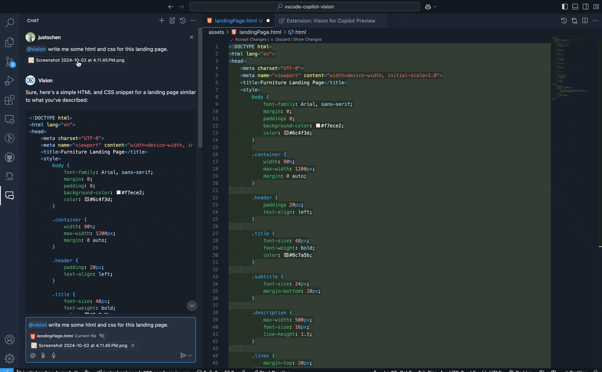

# Description

Vision for Copilot Preview is an extension that enhances chat interactions by enabling users to leverage advanced vision capabilities. This preview feature allows users to attach images directly as contextual input, enriching conversations and enabling more dynamic, visually-supported responses. This extension will be deprecated in favor of built-in image flow in Github Copilot Chat. 

For now, users can experience the image attachment flow by using their own OpenAI, Anthropic, or Gemini keys. Get started by easily attaching images from the clipboard or dragging them directly into the chat. 

Additionally, users can generate or refine alt text for images in markdown, HTMl, and tsx documents with the provided code action, simplifying the process of incorporating descriptive text for better context and accessibility.


## Contributed Commands and Settings
### Commands
- Set a Provider and Model.
- Set Current Model's API Key.
- Remove Current Model's API Key.
- Troubleshoot (screenshots the VS Code window and sends it to chat).

### Settings
- `copilot.vision.provider`: The selected provider (currently limted to OpenAI, Anthropic, and Gemini).
- `copilot.vision.model`: The model for the currently selected provider.


# How do I attach images?
1. Copy and Paste an image from the clipboard.
2. With an image in the clipboard, select the `Attach Context` button and select `Image from Clipboard` from the quick pick.
3. Click the `Attach Context` button and select an image in the workspace or `Screenshot Window`.
4. Drag and drop from anywhere outside VS Code into the chat panel.
5. From the command palette, select `Copilot Vision: Troubleshoot`. This is very useful for screen reader and beginner users for diagnosing issues in one's workspace.


# Proposed API Usage
This is the shape of the API:
```ts
export class ChatReferenceBinaryData {
	/**
	 * The MIME type of the binary data.
	 */
	readonly mimeType: string;

	/**
	 * Retrieves the binary data of the reference.
	 * @returns A promise that resolves to the binary data as a Uint8Array.
	 */
	data(): Thenable<Uint8Array>;

	/**
	 * @param mimeType The MIME type of the binary data.
	 * @param data The binary data of the reference.
	 */
	constructor(mimeType: string, data: () => Thenable<Uint8Array>);
}
```
After creating a chat handler, you can access attached variables via `request.references`.

Notes:
1. There are several variable types for handling images. Images can originate from a URI, which is typically sourced from a workspace or file explorer, or from ChatReferenceBinaryData, often used for images copied from the clipboard
2. `URI` files must be read and converted to `base64` strings to be used.
3. `ChatReferenceBinaryData` returns a promise that resolves to the binary data as a `UInt8Array`, which must be converted to `base64` strings to be used.

# Chat Example

Visual Studio Code's Copilot Chat architecture enables extension authors to integrate with the GitHub Copilot Chat experience. A chat extension is a VS Code extension that uses the Chat extension API by contributing a Chat participant. Chat participants are domain experts that can answer user queries within a specific domain.

When an extension uses the Chat or the Language Model API, we call it a GitHub Copilot Extension, since GitHub Copilot is the provider of the Chat and the Language Model experience.

This GitHub Copilot Extension sample shows:

- How to contribute a chat participant to the GitHub Copilot Chat view.
- How to use the proposed API (https://github.com/microsoft/vscode/blob/main/src/vscode-dts/vscode.proposed.chatReferenceBinaryData.d.ts) to get image data from the chat request. 



Documentation can be found here:
- https://code.visualstudio.com/api/extension-guides/chat
- https://code.visualstudio.com/api/extension-guides/language-model

## Running the Sample

- Run `npm install` in terminal to install dependencies
- Run the `Launch Extension` target in the Debug View. This will:
	- Start a task `npm: watch` to compile the code
	- Run the extension in a new VS Code window
	- You will see the @vision chat participant show in the GitHub Copilot Chat view


## Contributing
This project welcomes contributions and suggestions. Most contributions require you to agree to a Contributor License Agreement (CLA) declaring that you have the right to, and actually do, grant us the rights to use your contribution. For details, visit https://cla.opensource.microsoft.com.

When you submit a pull request, a CLA bot will automatically determine whether you need to provide a CLA and decorate the PR appropriately (e.g., status check, comment). Simply follow the instructions provided by the bot. You will only need to do this once across all repos using our CLA.

This project has adopted the Microsoft Open Source Code of Conduct. For more information see the Code of Conduct FAQ or contact opencode@microsoft.com with any additional questions or comments.

Tests can be run via `node -- test` after compiling the code with `npx tsc`.

## Trademarks
This project may contain trademarks or logos for projects, products, or services. Authorized use of Microsoft trademarks or logos is subject to and must follow Microsoft's Trademark & Brand Guidelines. Use of Microsoft trademarks or logos in modified versions of this project must not cause confusion or imply Microsoft sponsorship. Any use of third-party trademarks or logos are subject to those third-party's policies.
